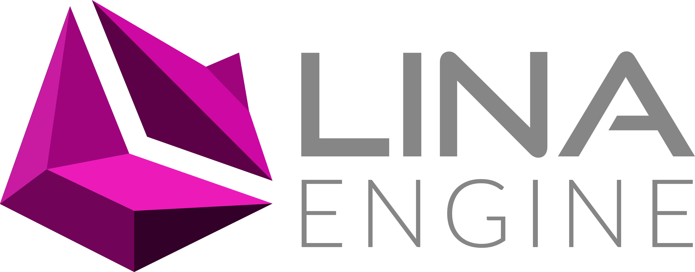
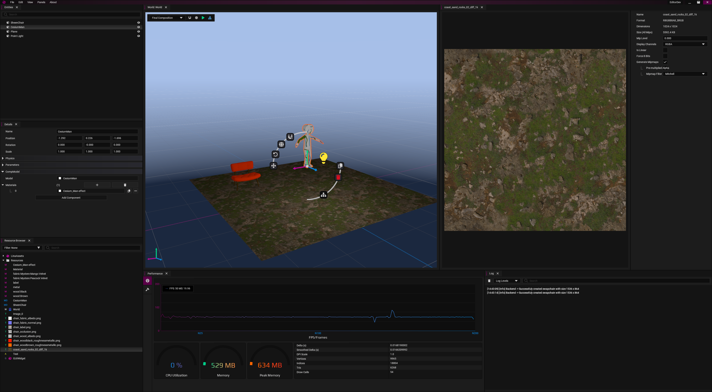
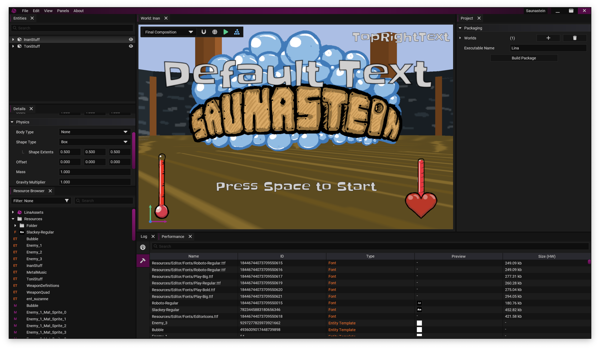

 

  

 

 

 
 

 

  
Lina Engine is a cross-platform, lightweight, straight to the point open-source 3D game engine. I've started making Lina as a research project during my Bachelors, and kept on developing as a personal engine. The reasoning behind Lina is first personal learning, and creating a library of tools for myself like [LinaVG](https://github.com/inanevin/LinaVG), a vector graphics library used in Lina's GUI and editor systems, or like [LinaGX](https://github.com/inanevin/LinaGX), a complete Vulkan, DX12 and Metal graphics backend. Secondly I'm making Lina to create a game engine that is free of today's existing bloat in variety of available game engines. It's designed to make highly customizable, small and performant games. 

Lina Engine is still under active development, so any contributions and discussions are welcome!

## Used Projects

-  [LinaGX](https://github.com/inanevin/LinaGX)
-  [LinaVG](https://github.com/inanevin/LinaVX)
-  [fmt](https://github.com/fmtlib/fmt)
-  [lz4](https://github.com/lz4/lz4)
-  [phmap](https://github.com/greg7mdp/parallel-hashmap)
-  [glm](https://github.com/g-truc/glm)
-  [Jolt Physics](https://github.com/jrouwe/JoltPhysics)
-  [openal](https://www.openal.org)
-  [stb](https://github.com/nothings/stb)
-  [taskflow](https://github.com/taskflow/taskflow)

## Building LinaEngine & Editor

- Clone Lina Engine main repository.
- Init submodules and update them, this will download LinaVG and LinaGX.
- Use CMake to generate project files and build.

## Using LinaEditor
- Download a release binary.
- Try to enjoy :).

# [License (BSD 2-clause)](http://opensource.org/licenses/BSD-2-Clause)

	Copyright [2018-] Inan Evin
	
	Redistribution and use in source and binary forms, with or without modification,
	are permitted provided that the following conditions are met:
	
	   1. Redistributions of source code must retain the above copyright notice, this
	      list of conditions and the following disclaimer.
	
	   2. Redistributions in binary form must reproduce the above copyright notice,
	      this list of conditions and the following disclaimer in the documentation
	      and/or other materials provided with the distribution.
	
	THIS SOFTWARE IS PROVIDED BY THE COPYRIGHT HOLDERS AND CONTRIBUTORS "AS IS" AND
	ANY EXPRESS OR IMPLIED WARRANTIES, INCLUDING, BUT NOT LIMITED TO, THE IMPLIED
	WARRANTIES OF MERCHANTABILITY AND FITNESS FOR A PARTICULAR PURPOSE ARE DISCLAIMED.
	IN NO EVENT SHALL THE COPYRIGHT HOLDER OR CONTRIBUTORS BE LIABLE FOR ANY DIRECT,
	INDIRECT, INCIDENTAL, SPECIAL, EXEMPLARY, OR CONSEQUENTIAL DAMAGES (INCLUDING,
	BUT NOT LIMITED TO, PROCUREMENT OF SUBSTITUTE GOODS OR SERVICES; LOSS OF USE,
	DATA, OR PROFITS; OR BUSINESS INTERRUPTION) HOWEVER CAUSED AND ON ANY THEORY
	OF LIABILITY, WHETHER IN CONTRACT, STRICT LIABILITY, OR TORT (INCLUDING NEGLIGENCE
	OR OTHERWISE) ARISING IN ANY WAY OUT OF THE USE OF THIS SOFTWARE, EVEN IF ADVISED
	OF THE POSSIBILITY OF SUCH DAMAGE.

# Contributing

Any contributions and PR are welcome.

# Support

You can join [Lina Engine's Discord channel](https://discord.gg/QYeTkEtRMB) to talk about the Lina Project.
