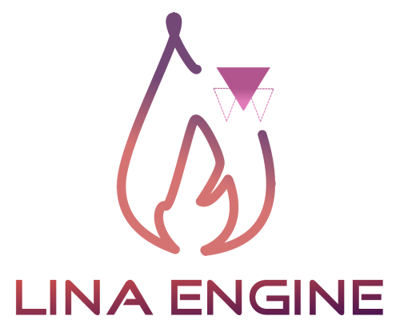
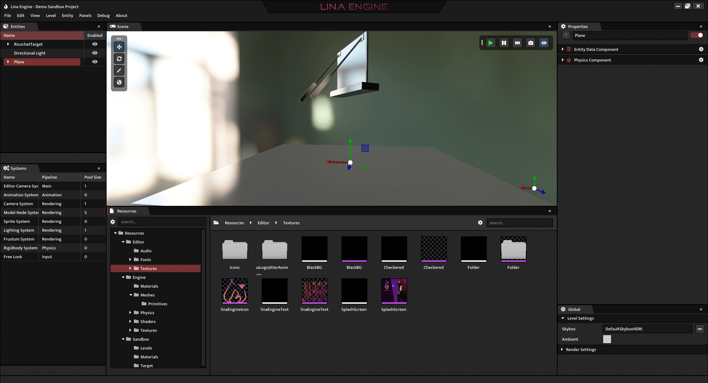
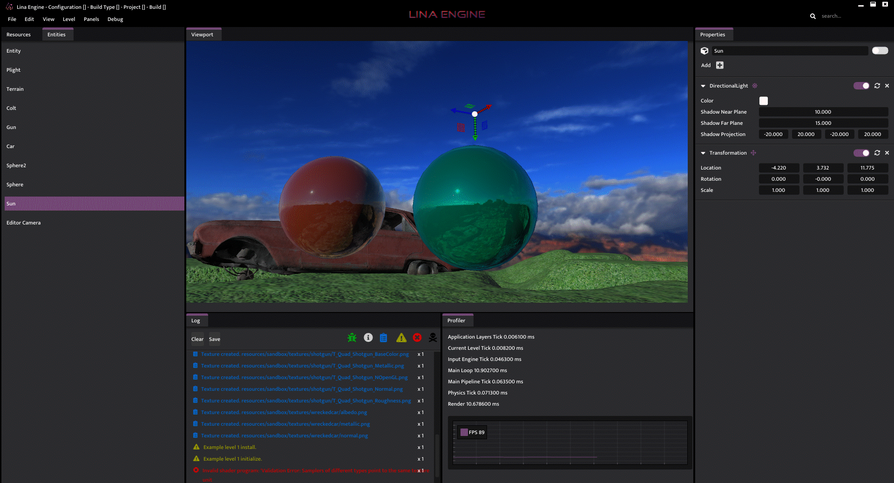
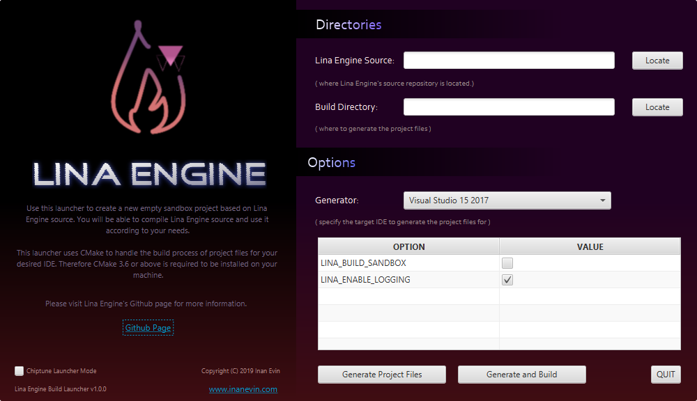

## Lina Engine  
[](https://opensource.org/licenses/MIT) 
[](https://www.codacy.com/gh/inanevin/LinaEngine/dashboard?utm_source=github.com&amp;utm_medium=referral&amp;utm_content=inanevin/LinaEngine&amp;utm_campaign=Badge_Grade)
[](https://app.travis-ci.com/inanevin/LinaEngine)
[](https://github.com/inanevin/LinaEngine/issues) 


Lina Engine is a lightweight and ECS based open-source game engine. Initially it's a research project and is aimed to be a basis of development for more open-source game engine projects. Lina's architecture is designed to be as modular as possible and it focuses on creating replacable modules to customize for project-specific needs, rather than stacking thousands of features into one framework.

[Visit the project page on my website for more information](https://www.inanevin.com/gameprojects/linaengine)




## Announcements / Notes

- Lina Engine is currently compatible to be compiled only with x64 architecture on Windows. If you would like to use it on different architectures & platforms, you need to compile the vendors for your target architecture and platform include them manually.

- Lina is currently in active development so it's not stable on all platforms. It's being developed in Visual Studio 2019 in Windows 10 with x64 architecture, so that's the best setup to contribute to the project for now.

## Lina Engine Tools

- [Lina Engine Build Launcher](https://github.com/inanevin/Lina-Engine-Build-Launcher) (deprecated)

## External Dependencies

-  [assimp](https://github.com/assimp/assimp)
-  [bullet3](https://github.com/bulletphysics/bullet3)
-  [cereal](https://github.com/USCiLab/cereal)
-  [entt](https://github.com/skypjack/entt)
-  [fmt](https://github.com/fmtlib/fmt)
-  [fontawesome](https://github.com/FortAwesome/Font-Awesome)
-  [forkawesome](https://github.com/ForkAwesome/Fork-Awesome)
-  [glm](https://github.com/g-truc/glm)
-  [glfw](https://github.com/glfw/glfw)
-  [glad](https://github.com/Dav1dde/glad)
-  [iconfontcppheaders](https://github.com/juliettef/IconFontCppHeaders)
-  [imgui](https://github.com/ocornut/imgui)
-  [stb](https://github.com/nothings/stb)

## Installation

-  Clone Lina Engine git repository

```shell
# Initialize git in your desired directory.
git init

# Clone Lina Engine
git clone https://github.com/inanevin/LinaEngine

# Alternatively you can clone recursively, this will download all the submodules if there exists any along with Lina Engine source code.
git clone --recursive https://github.com/inanevin/LinaEngine

```
-  You can generate the project files and build using; ~~**Lina Engine Build Launcher (deprecated)**~~, **CMake with Shell** or **CMake GUI**

#### Using Lina Engine Build Launcher (deprecated)

-  You need to have JavaFX Runtime library installed on your computer & environment paths set for it. For more information visit [Java FX](https://openjfx.io/).
-  Download a binary release from [Lina Engine Build Launcher Repository](https://github.com/inanevin/Lina-Engine-Build-Launcher).
-  Run the .jar file, launcher will open.



-  Select the directory where you downloaded Lina Engine's source. (this repository)
-  Select your desired build directory for project files.
-  Select your target generator & desired build options.
-  Hit "Generate Project Files" to generate only the project files, hit "Generate and Build" to generate project files and then build the binaries using the generated files.


#### Using CMake with Shell

-  Run your shell, command line or terminal in the repository directory. Afterwards, execute generation / build commands.

```shell
# You can define any options before generating project files.
cmake -DLINA_CORE_ENABLE_LOGGING=OFF

# You can define multiple options sequentially.
cmake -DLINA_CORE_ENABLE_LOGGING=OFF -DLINA_CLIENT_ENABLE_LOGGING=OFF

# It is recommended to declare the type of the option if multiple options are defined
cmake -DLINA_CORE_ENABLE_LOGGING:BOOL=OFF -DLINA_CLIENT_ENABLE_LOGGING:BOOL=OFF -DCMAKE_CONFIGURATION_TYPES:STRING="Debug,Release"

# Above commands will generate project files with default generator, you can specify a generator if you want.
cmake -DLINA_CORE_ENABLE_LOGGING=OFF -G "Visual Studio 15 2017"

```
-  After generating project files you can either open your IDE and build the ALL_BUILD project which will build all the targets or you can build the binaries from shell.

```shell
# Create a directory for binaries
mkdir bin

# Navigate to directory
cd bin

# Build the root project
cmake ../ -G "Visual Studio 16 2019" -A "x64"

# After the project files are built, you can build the project via
cmake --build . --target ALL_BUILD

```
-  Check out [CMake Documentation](https://cmake.org/cmake/help/v3.2/manual/cmake.1.html) for specifying more options and configurations like project file generation directories and more.

#### Using CMake GUI

-  Choose the directory where the repository is as the source directory.
-  Choose a build directory, this can be the same as the source directory or anywhere you like.
-  Hit configure, select the IDE you want to generate the project files for and x64 architecture.
-  Select options, you can leave them as default.
-  Hit generate, this will generate the project files for your desired IDE.

## Build Options

| Option  | Description | Default |
| ------------- | ------------- | ------------- |
| LINA_CLIENT_ENABLE_LOGGING  | Enables log features for client modules, like Sandbox.  | ON  |
| LINA_CORE_ENABLE_LOGGING | Enables log features for core modules.  | ON |
| LINA_ENABLE_EDITOR  | Enables the editor gui.  | ON |
| LINA_ENABLE_TIMEPROFILING | If enabled, core Lina systems will record their execution durations which can be polled from anywhere to display profiling data. | ON  |
| CMAKE_CONFIGURATION_TYPES | Config types that will be available on the IDE. | Debug, Release, MinSizeRel, RelWithDebInfo  
  |

## License

[](https://opensource.org/licenses/MIT) 
Check out [Licence](LICENSE) file.

## Design Diagrams

### System Architecture


### Design Document

[Link to the Software Design Document of Lina Engine (PDF)](https://www.inanevin.com/docs/lina_sdd.pdf)

[Lina Engine Project Report (PDF)](https://www.inanevin.com/docs/lina_postmortem.pdf)

